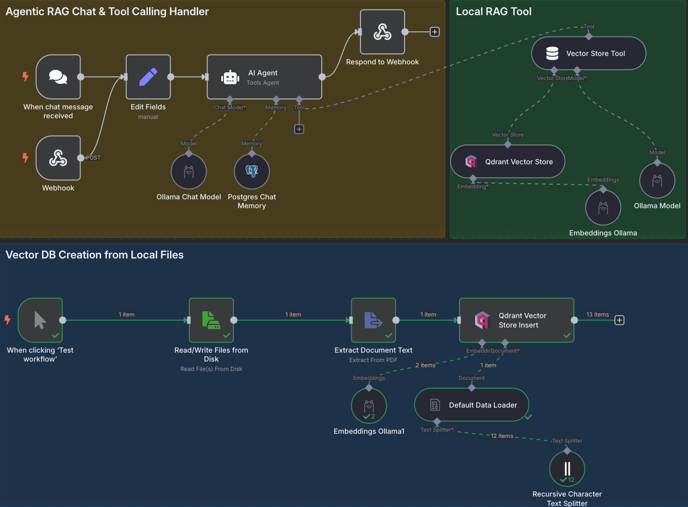

# Agentic RAG




## Overview
Agentic RAG (Retrieval Augmented Generation) is an AI-powered system that combines the capabilities of RAG with autonomous agent behaviors. This system:

- Retrieves relevant information from a knowledge base using vector similarity search
- Augments LLM responses with this retrieved context for more accurate and informed answers
- Incorporates agentic behaviors allowing the system to take actions based on user requests
- Uses n8n workflows to orchestrate the RAG pipeline and agent actions
- Stores conversations in PostgreSQL and vector embeddings in Qdrant
- Provides a simple API endpoint for integration with other applications

This project demonstrates how to build and deploy a self-hosted AI solution with document retrieval capabilities and autonomous behaviors.

## Installation

### Cloning the Repository

```bash
git clone https://github.com/pythinker/agentic-rag.git
```

### Running n8n using Docker Compose on Mac
```
cd agentic-rag
rm -rf ./volumes
docker compose up
```

The Editor is now accessible via `http://localhost:5678/`:
1. Head to `http://localhost:5678/home/credentials`
2. Click on 'Local Ollama service'
3. Change the base URL to `http://host.docker.internal:11434/`
4. Set the Host of the PostgreSQL widget on n8n to `postgres`
5. Set the Qdrant URL to `http://qdrant:6333`


## Usage
### ChatBot
#### Store Source Documents
Put all your PDF files into the `./shared` folder
#### Create Embeddings for Source Documents
```bash
curl -X GET http://localhost:5678/webhook/create_source_embeddings -H "Content-Type: application/json"
```
#### Ask Questions about the Source Documents
```bash
curl -X POST http://localhost:5678/webhook/invoke_n8n_agent -H "Content-Type: application/json" -d '{"chatInput": "What are the ingredients of Apple Berry Crisp?", "sessionId": "c324038d8b2944a0855c2e40441038e3"}'
```

### Accessing PostgreSQL and Qdrant DBs
You can access PostgreSQL and Qdrant DBs in these addresses, respectively:
- `http://localhost:5050`
- `http://localhost:6333/dashboard`
